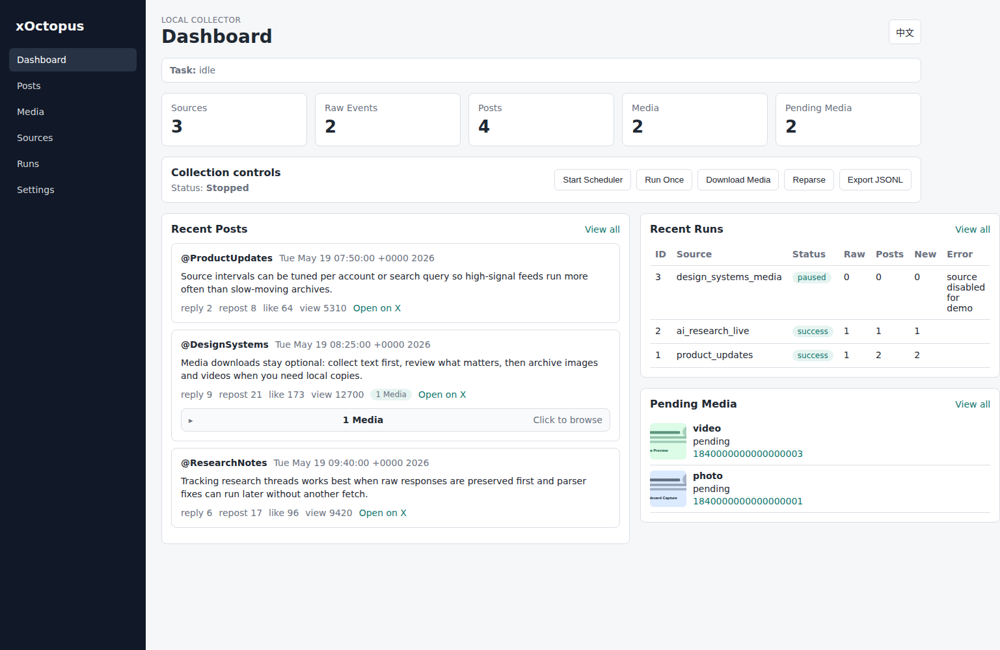
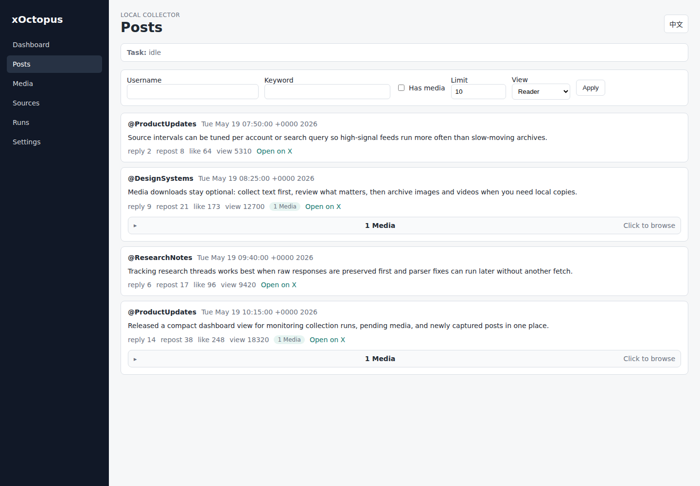
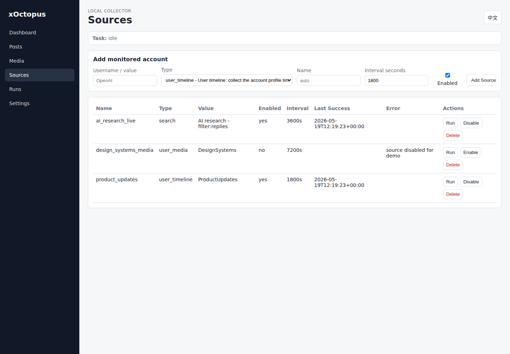

# xOctopus

Local-first X Web archiving for posts, sources, and media.

xOctopus captures the X Web responses your logged-in browser can already access,
keeps raw JSON for future reparsing, and lets you inspect everything locally
through a CLI or Web dashboard. It is designed for researchers, analysts,
builders, and personal archivists who want a local, inspectable archive without
running a cloud service or handing credentials to a third party.



## Highlights

- Local-first archive: SQLite, local browser profile, local cookie files, local exports
- `./xo` helper command for local repo usage
- CLI for scripts, cron, and terminal-only servers
- Optional local Web dashboard
- Browser profile login through Playwright
- Cookie-file login for no-GUI deployments
- Chrome/Chromium cookie exporter extension
- Explicit multi-account binding for user-owned login sessions
- Session health and backoff for auth, challenge, warning, and limit states
- SQLite storage with portable JSONL export
- Source management for users, searches, lists, posts, and media pages
- Per-source collection progress, with `--quiet` for cron
- English and Chinese Web UI labels

If you installed xOctopus as a package, use `xoctopus ...` instead of `./xo ...`.
The examples below use `./xo` because that is the easiest path when running from
this repository.

## Why xOctopus

### Local-first

Your config, browser profile, cookies, SQLite database, raw responses, media
library, and JSONL exports stay on your machine.

### Bring your own session

Use a visible browser profile or exported cookies from your own logged-in
browser. xOctopus does not ask for your password.

### Raw data preserved

Captured X Web JSON responses are kept so parser improvements can reprocess old
runs without fetching the same pages again.

### CLI and Web UI

Run collection from cron or a terminal, then browse posts, runs, sources, and
media from the optional local dashboard.

### Session health and backoff

xOctopus records account/source health. When X asks for login, verification, or
manual review, xOctopus pauses and tells you what to fix. When X returns rate
limits or repeated failures, xOctopus backs off before retrying.

## Quick Start

### A. Browser Profile Login

Use this when the machine running xOctopus has a visible browser.

```bash
uv sync
uv run playwright install chromium

./xo init
./xo login
./xo run --once
./xo posts --limit 20
```

`./xo login` opens a persistent browser profile. Log in manually, then return to
the terminal and press Enter. Future collection runs reuse that profile.

### B. Cookie Login For Terminal-Only Servers

Use this when the server has no GUI.

1. On a desktop Chrome/Chromium/Edge browser, load the unpacked extension from
   `browser-extension/xoctopus-cookie-exporter`.
2. Open `https://x.com` and log in manually.
3. Click the xOctopus Cookie Exporter extension.
4. Confirm `auth_token` and `ct0` show `yes`.
5. Export `xoctopus-x-cookies.json`.
6. Move it to the server as `data/cookies/x.cookies.json`.

Set this in `config.toml`:

```toml
[auth]
mode = "cookies"
cookies_file = "data/cookies/x.cookies.json"
cookies_format = "playwright"
refresh_cookies = true
```

Then validate and collect:

```bash
./xo auth status
./xo auth validate
./xo run --once
```

Cookie files can access your X session. Store them like passwords and do not
commit them to Git.

### C. Optional Web Dashboard

Install the Web extra and start the local dashboard:

```bash
uv sync --extra web
./xo web
```

Open:

```text
http://127.0.0.1:8787
```

The Web dashboard reuses the same `config.toml`, browser profile, cookie file,
SQLite database, and media library as the CLI.

## Install

For CLI-only use from a package:

```bash
pip install xoctopus
playwright install chromium
```

For the Web dashboard:

```bash
pip install "xoctopus[web]"
playwright install chromium
```

On Linux systems where bundled Chromium is not suitable, install Chrome or
Chromium with your package manager and configure `browser.channel` or
`browser.executable_path` in `config.toml`.

## Login Methods

| Mode | Best for | How it works |
| --- | --- | --- |
| Browser profile | Desktop/local machine | `./xo login` opens a browser and saves the session |
| Cookie file | No-GUI server | Export cookies with the included browser extension |
| Explicit account binding | Multiple user-owned sessions | Bind each source to a named account in `config.toml` |

### Browser Profile

```bash
./xo init
./xo login
```

This stores the session under:

```text
data/browser-profile/
```

You can also export cookies from that profile:

```bash
./xo login --export-cookies data/cookies/x.cookies.json
./xo auth export-cookies --output data/cookies/x.cookies.json
```

### Cookie File

xOctopus stores cookie login files in Playwright JSON format:

```text
data/cookies/x.cookies.json
```

Import cookies from another extension or tool:

```bash
./xo auth import-cookies --file cookies.txt --format netscape --output data/cookies/x.cookies.json
./xo auth import-cookies --file xoctopus-x-cookies.json --format playwright
```

Check local cookie structure without contacting X:

```bash
./xo auth status
```

Validate the real login state with a headless browser:

```bash
./xo auth validate
```

### Browser Extension

The included extension lives at:

```text
browser-extension/xoctopus-cookie-exporter/
```

Load it locally:

1. Open `chrome://extensions` or the equivalent Edge extensions page.
2. Enable Developer mode.
3. Click Load unpacked.
4. Select `browser-extension/xoctopus-cookie-exporter`.

The extension only requests cookie access for X/Twitter domains and downloads a
Playwright-compatible file named `xoctopus-x-cookies.json`.

### Explicit Multi-Account Binding

xOctopus can manage multiple user-owned login sessions and bind each source to a
specific account. This is for separating legitimate sessions and workflows, not
for automatically switching accounts to bypass rate limits, challenges, or other
access controls.

```toml
[[accounts]]
name = "main"
auth_mode = "cookies"
cookies_file = "data/accounts/main.cookies.json"
cookies_format = "playwright"
refresh_cookies = true

[[accounts]]
name = "research"
auth_mode = "cookies"
cookies_file = "data/accounts/research.cookies.json"
cookies_format = "playwright"
refresh_cookies = true

[[sources]]
name = "openai_timeline"
type = "user_timeline"
value = "OpenAI"
account = "main"
enabled = true
poll_interval_seconds = 1800
```

Useful commands:

```bash
./xo account list
./xo account status main
./xo account import-cookies main --file xoctopus-x-cookies.json
./xo account validate main
./xo account resume main
```

## Session Health & Backoff

xOctopus tracks session health without bypassing access controls. It can pause
or back off accounts and sources after common failure states:

```text
auth_required
challenge_required
account_warning
rate_limited
no_data
```

Configuration:

```toml
[health]
enabled = true
pause_on_auth_required = true
pause_on_challenge = true
pause_on_account_warning = true
backoff_on_rate_limit_seconds = 3600
backoff_on_no_data_seconds = 900
max_consecutive_failures = 3
failure_backoff_seconds = 1800
```

Inspect and recover:

```bash
./xo account list
./xo account status main
./xo source status
./xo account resume main
./xo source resume openai_timeline
```

xOctopus does not rotate accounts to bypass limits or challenges.

## Common CLI Commands

```bash
./xo init
./xo login
./xo login --export-cookies data/cookies/x.cookies.json
./xo auth status
./xo auth validate
./xo auth import-cookies --file xoctopus-x-cookies.json --format playwright
./xo account list
./xo account status main
./xo account import-cookies main --file xoctopus-x-cookies.json
./xo account validate main
./xo account resume main
./xo source status
./xo source resume openai_timeline
./xo source list
./xo source add user OpenAI
./xo source add search "(AI OR agent) -filter:replies"
./xo collect user OpenAI
./xo collect user OpenAI --account main
./xo run --once
./xo run --once --quiet
./xo run --watch
./xo status
./xo posts --limit 20
./xo posts --table --limit 20
./xo media list --pending
./xo media download --limit 50
./xo export --format jsonl --output exports/posts.jsonl
./xo web
```

`./xo run --once` prints per-source progress by default. Use `--quiet` when you
only want the final summary, such as in cron logs.

For a simple always-on local loop:

```bash
while true; do
  ./xo run --once --quiet
  ./xo media download --limit 50
  sleep 1800
done
```

For cron, set `browser.headless = true` after login works:

```cron
*/30 * * * * cd /path/to/xOctopus && flock -n /tmp/xoctopus.lock ./xo run --once --quiet >> data/logs/cron.log 2>&1 && ./xo media download --limit 50 >> data/logs/cron.log 2>&1
```

## Web Dashboard



The Web UI is a local dashboard for source management, collection runs, post
reading, media browsing, and JSONL export.



Available views:

```text
Dashboard
Posts
Media
Sources
Runs
Settings
```

## Data Layout

```text
config.toml
data/xoctopus.sqlite3
data/browser-profile/
data/cookies/x.cookies.json
data/accounts/{account}.cookies.json
data/logs/
data/raw/
library/{username}/{post_id}/
exports/posts.jsonl
```

Text and metadata live in SQLite. Raw captured responses are retained for later
parser improvements. Downloaded media is stored under `library/`. Normalized
posts can be exported as JSONL.

## 中文快速说明

xOctopus 是一个本地运行的 X Web 内容采集工具。它不会绕过验证码、平台限制、
私密账号或访问控制，只复用你自己已经登录的浏览器会话或 cookie 文件。
多个账号场景下，每个采集源需要显式绑定账号；工具不会在风控、限流或验证
失败后自动切换账号继续采集。

本机有浏览器时：

```bash
./xo init
./xo login
./xo run --once
./xo posts --limit 20
```

无 GUI 服务器使用 cookie 登录：

1. 在桌面版 Chrome/Edge 中加载 `browser-extension/xoctopus-cookie-exporter`。
2. 打开 `https://x.com` 并手动登录。
3. 用插件导出 `xoctopus-x-cookies.json`。
4. 上传为 `data/cookies/x.cookies.json`。
5. 在 `config.toml` 中设置：

```toml
[auth]
mode = "cookies"
cookies_file = "data/cookies/x.cookies.json"
cookies_format = "playwright"
refresh_cookies = true
```

然后执行：

```bash
./xo auth status
./xo auth validate
./xo run --once
```

会话健康与退避：

```bash
./xo account list
./xo source status
./xo account resume main
./xo source resume openai_timeline
```

xOctopus 会在登录失效、人工验证、账号警告、限流或连续失败时记录健康状态，
并暂停或退避相关账号/source。它不会自动换号绕过限制或验证。

启动 Web 界面：

```bash
./xo web
```

浏览器打开：

```text
http://127.0.0.1:8787
```

## Boundaries


## Boundaries

xOctopus does not bypass private accounts, paywalls, blocks, captchas, login
challenges, rate limits, or other access controls. It does not post, like,
follow, repost, send messages, or otherwise automate account actions.

If X presents a login challenge, captcha, rate limit, or account warning, pause
collection and resolve it manually in the browser.

For multiple accounts, xOctopus supports explicit account binding. It does not
automatically rotate accounts after rate limits, challenges, captcha, account
warnings, or login failures.

## Status

Current package version: `0.5.0`.

xOctopus is an early MVP. The CLI, Web dashboard, SQLite storage, source
management, JSONL export, Playwright response capture, raw response storage,
cookie-file auth, explicit account binding, browser cookie exporter, session
health and backoff, and first-pass timeline/search parsing are in place. X Web
response shapes change often, so parser coverage should be expanded over time
with saved raw fixtures.

For detailed local usage steps, see [USAGE.md](USAGE.md).
