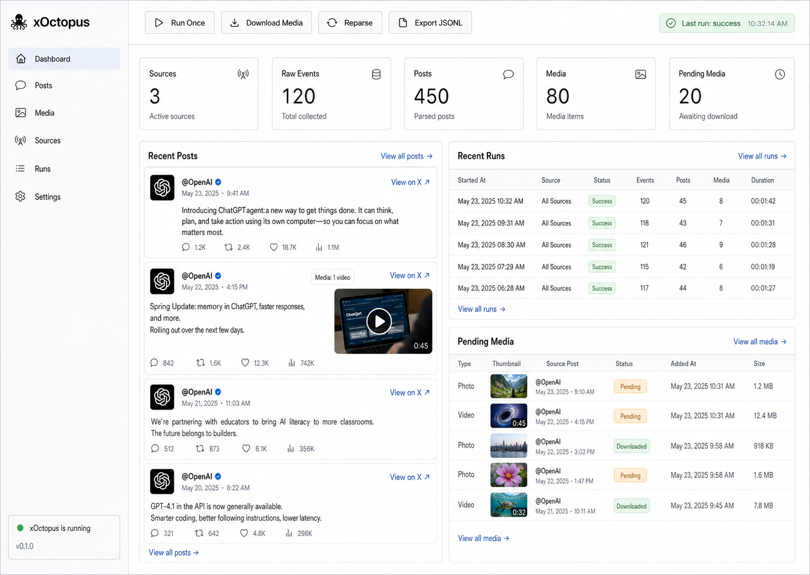

# xOctopus Web Prototype

This is the proposed lightweight local Web UI for the current terminal version.



## Product Goal

The Web version should be a local single-user dashboard over the existing CLI
collector. It should reuse `config.toml`, `data/xoctopus.sqlite3`, and
`library/` instead of introducing a separate service architecture.

Default access:

```text
http://127.0.0.1:8787
```

## V1 Pages

```text
Dashboard   status summary and primary actions
Posts       readable collected post cards
Media       captured media assets and download state
Sources     configured collection sources
Runs        recent fetch run history
Settings    read-only key config values
```

## Dashboard

The dashboard should show:

```text
Sources
Raw Events
Posts
Media
Pending Media
Last Run Status
```

Primary actions:

```text
Run Once
Download Media
Reparse
Export JSONL
```

## Posts View

Each post card should show:

```text
username
created time
post text
reply/repost/like/view counts
media badge
preview URL or thumbnail when available
X post link
```

Initial filters:

```text
username
has media
keyword
limit
```

## Media View

Each media card should show:

```text
media type
download status
username
post link
size
preview URL
remote URL
local path
error if failed
```

Actions:

```text
Download pending
Download photos
Download videos
```

## Technical Shape

Recommended stack:

```text
FastAPI
Jinja2
HTMX
plain CSS
SQLite
```

Suggested package layout:

```text
xoctopus/web/
  __init__.py
  app.py
  routes.py
  tasks.py
  templates/
    base.html
    dashboard.html
    posts.html
    media.html
    sources.html
    runs.html
    settings.html
  static/
    app.css
```

Suggested CLI entry:

```bash
./xo web
```

## Implementation Notes

Keep the Web version thin:

```text
Use existing db functions where possible.
Use existing jobs.discover.run_once for collection.
Use existing media download logic.
Use one in-memory background task slot for V1.
Do not add Celery, Redis, PostgreSQL, or a frontend build step.
```

V1 can run actions through a single `ThreadPoolExecutor(max_workers=1)` so the
UI remains responsive while collection or media download is running.

